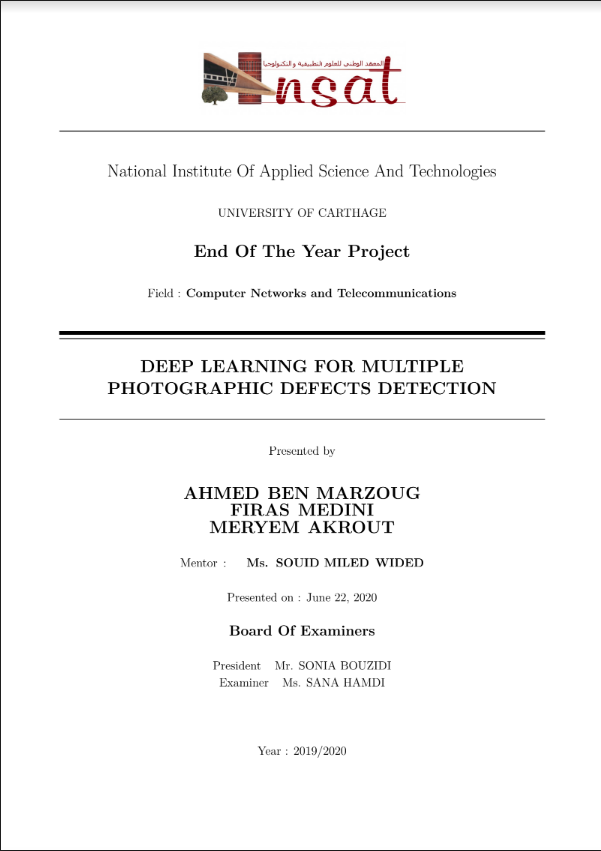
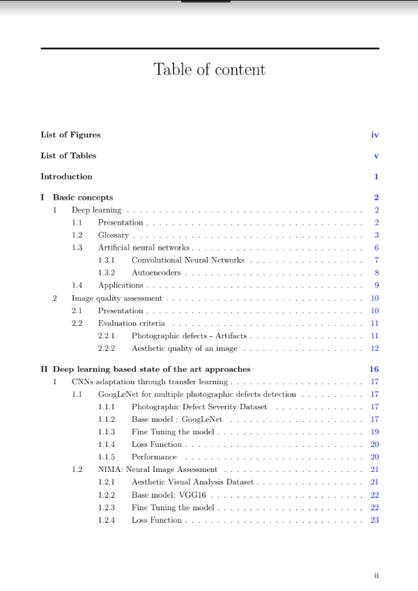
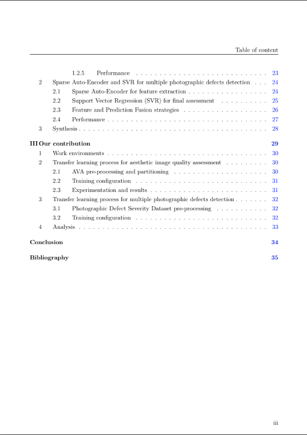

# DEEP LEARNING FOR MULTIPLE PHOTOGRAPHIC DEFECTS DETECTION
End of year project by Meryem Akrout, Firas Medini and Ahmed Ben Marzoug from the National Institute of Applied Science and Technology.

Follow this link for a more details about our research (PDF file) : https://bit.ly/2FHnt87

    
    
    

## Research papers that have been studied:

### Learning to Detect Multiple Photographic Defects

Adapting GoogLeNet for multiple photographic defects detection through transfer learning.

### NIMA: Neural Image Assessment

Adapting VGG16 for image aestheticquality assessment through transfer learning.

### Sparse Auto-Encoder and SVR for multiple photographic defects detection

Use of a sparse autoencoder (SAE) as feature extractor and an SVR machine to learn the regression function from the image features to the perceived quality scores.

## Proposed method

The difference between our work and the previously mentioned state of art approaches is making extensive useof the transfer learning technique. The main idea is to fine tune and retrain an image classifieron the AVA dataset for aesthetic image quality assessment first, followed by the Photographic Defect Severity Dataset for photographic defects detection. We expect that this approach willhave better results as the AVA Dataset is large enough to perform an effective transfer learning process of the image classifier from the image classification domain to the aesthetic imagequality assessment domain. The multiple photographic defects detection domain is much closer to the aesthetic image quality assessment domain than the image classification domain, which will enable us to perform a second effective transfer learning process despite the small size of the Photographic Defect Severity subset from the Yahoo Flickr Creative Common dataset used by Yu, Ning et al.

## Code explanation

This repository contains the minimal amount of code required to construct and train our proposed model.

### ./paths.json

Set the paths for downloads (torrent files, compressed files), datasets (actual datasets' images) and training data (training checkpoints and model).

### ./Init.ipynb

Download all required packages and software.

### ./TL1/ava.ipynb

Download the AVA dataset. The labels we provide were obtained from https://github.com/idealo/image-quality-assessment

### ./TL1/Launcher.ipynb

Download VGG16, adjust it to the first Transfer learning phase, and create all the required folders for training, finally start the training process.

### ./TL1/Training.ipynb

Contains the actual steps of the training process of the first Transfer Learning.
This script will run 20 times and train the model for 1 epoch, then save the weights at the end. It can take up to 10GB.

### ./TL1/Monitoring.ipynb

Optional. You can run it to monitor the training process of the first Transfer learning phase.

### ./TL2/YF.ipynb

Download the Yahoo Flickr subset. The labels we provide were obtained from https://github.com/ningyu1991/DefectDetection

### ./TL2/Launcher.ipynb

Loads and adjusts the last model from the first Transfer Learning phase, for the second Transfer Learning phase, and create all the required folders for training, finally start the training process.

### ./TL2/Training.ipynb

Contains the actual steps of the training process of the second Transfer Learning.
This script will run 200 times and train the model for 1 epoch, then save the weights at the end. It can take up to 100GB.

### ./TL2/Monitoring.ipynb

Optional. You can run it to monitor the training process of the second Transfer learning phase.
